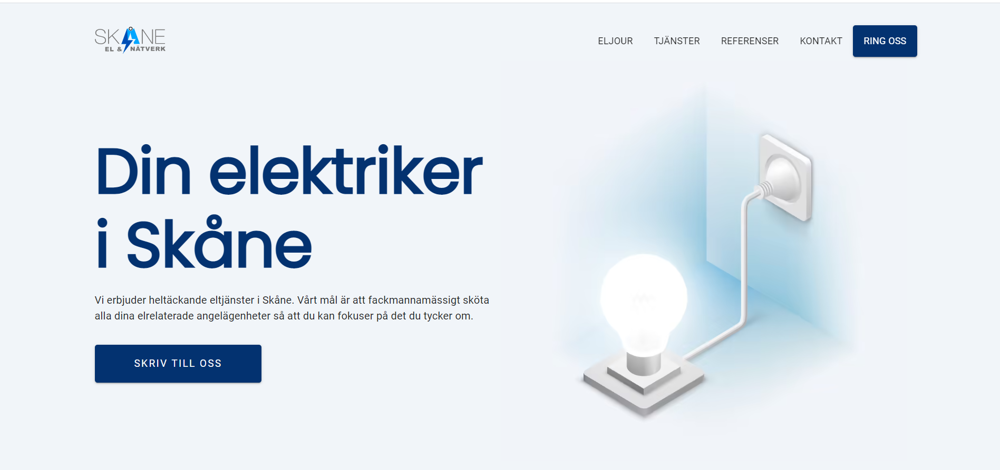

# Company Website • Skåne El & Nätverk

[www.skaneelochnatverk.se](https://skaneelochnatverk.se)

 &nbsp; 

**Jamstack** website built with **Gatsby** and **TypeScript**, consuming content from **GraphCMS**.
